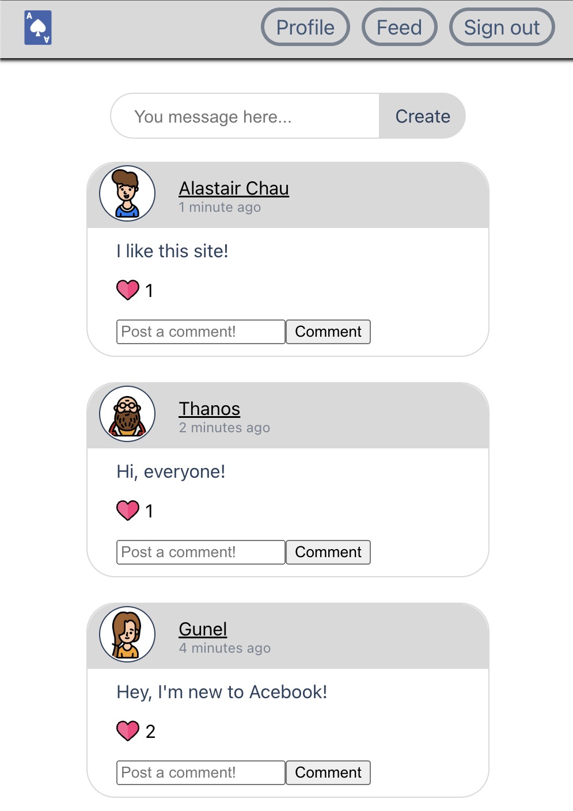
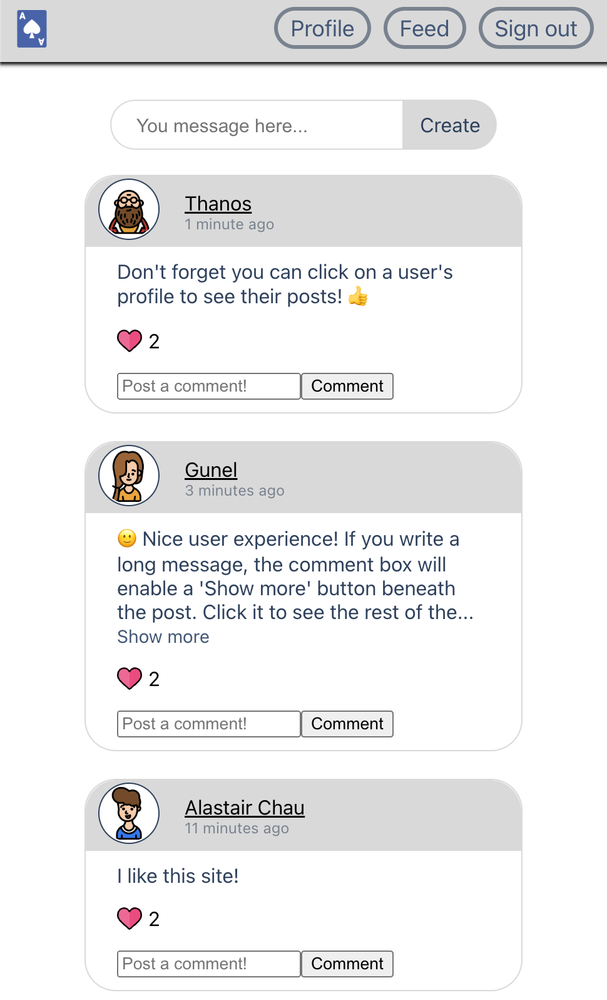

# Acebook

In this project, six of us were tasked with working on an existing MERN application. The challenge was to familiarise ourselves with an unknown codebase with technologies we'd little to no previous experience. We had to improve and extend it into a fully functioning app that we could present to the stakeholders.

## Contents

[Screenshots](#screenshots)

[Video Runthrough](#video-runthrough)

[How to try the project](#how-to-try-the-project)

## Screenshots

A selection of screenshots





## Video Runthrough

See some of the app features and learn about the way the product was built.

**[CLICK TO WATCH]**

[](https://youtu.be/aNMJOOEB6TA 'Acebook: Team Project in MERN')

## How to try the project

### Setup

1. Clone the repo
2. Install Node.js dependencies for both front and backend directories

   ```bash
   ; cd api
   ; npm install
   ; cd ../frontend
   ; npm install
   ```

3. Install MongoDB

   ```bash
   brew tap mongodb/brew
   brew install mongodb-community@5.0
   ```

4. Start MongoDB

   ```bash
   brew services start mongodb-community@5.0
   ```

### Running

1.  Start the server

    ```bash
    ; cd api
    ; JWT_SECRET=SUPER_SECRET npm start
    ```

2.  Start the front end
    In a new terminal session...

        ```bash
        ; cd frontend
        ; npm start
        ```

You should now be able to open your browser and go to `http://localhost:3000/`
